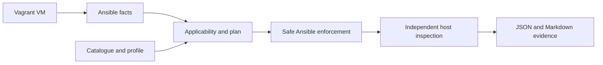

# HardenOps

**Version 0.1.0** — an Ansible-based Linux hardening lab that implements and
verifies selected ANSSI-BP-028 controls, with an explicit plan and traceable
security evidence.

The project connects a reviewed security reference to small, reproducible host
changes and independently observed results. It is intended for a disposable lab
and for reviewing hardening as code. It does not constitute ANSSI certification,
regulatory compliance, security homologation, or a substitute for a formal audit.

## Scope

| Target | Implementation | Validation boundary |
| --- | --- | --- |
| Ubuntu Server 24.04 LTS | Debian-family facts, package preflight, shared roles | See [validation record](docs/validation.md) |
| Rocky Linux 9 | Red Hat-family facts, package preflight, shared roles | See [validation record](docs/validation.md) |
| Minimal | 7 selected recommendations, audit/manual/reference review only | No automatic changes in this subset |
| Intermediary | Cumulative Minimal review plus 21 entries | 19 automated controls and 2 manual entries |
| Enhanced / High | Metadata only | Requests fail explicitly |

The catalogue contains **28 atomic entries**: 19 AUTOMATED, 4 AUDIT_ONLY,
4 MANUAL and 1 OUT_OF_SCOPE_REFERENCE_REQUIRED. The VERIFIED classification is
supported but has no verification-only entries in this release. PASS is an
observed result, never an implementation claim. The complete guide is larger
than this selected subset; these numbers are not an ANSSI compliance score.

## Architecture



Ansible stays central. Domain roles share tasks across distributions. A small
read-only Python inspector reads host state without trusting previous task
success. See [architecture](docs/architecture.md) and
[ANSSI mapping](docs/anssi-mapping.md).

## Quick start

Use a Linux controller with Python 3.12 or 3.13, GNU Make, Vagrant and a working
libvirt/KVM provider (`vagrant-libvirt`). VirtualBox is an alternative. Native
Windows is not an Ansible controller. Provider and WSL limitations are described
in [distributions and provisioning](docs/distributions.md).

```bash
python3 -m venv .venv
. .venv/bin/activate
make install
make help
make deploy DISTRO=ubuntu2404
make status
make plan LEVEL=minimal
make harden LEVEL=minimal
make verify LEVEL=minimal
make plan LEVEL=intermediary
make harden LEVEL=intermediary
make verify LEVEL=intermediary
make destroy
```

Use `make deploy DISTRO=rocky9` for Rocky or append `PROVIDER=virtualbox` when
deploying. The helper remembers one active lab's distro and provider. Destroy it
before switching distributions. Box versions are pinned; hashes and exact provider
availability are described by the registry sources in the provisioning guide.
`make destroy` deletes the disposable VM; evidence is retained separately.

Deployment creates an inventory from `vagrant ssh-config`, prepares a local SSH
known-hosts file and runs the read-only baseline checks. First contact trusts the
new local lab key; later key changes fail. SSH keys and lab state are ignored by
Git. Do not point this lab workflow at production infrastructure.

## Planning and enforcement

`make plan` prints detected OS, version, architecture, kernel, profile, result
counts and each control's applicability, risk, reboot flag and planned change.
It does not modify the target's configuration. Audit findings require a human
decision even if all automatic checks pass.

`make harden` repeats live inspection, checks safety and enforces only selected,
supported automated controls. It then independently verifies and saves evidence.
The Minimal profile performs no automatic remediation in v0.1. This reflects the
levels of the controls actually selected from the source, rather than relabelling
Intermediary kernel recommendations as Minimal.

Default assumptions in `ansible/group_vars/all.yml` are:

```yaml
hardenops_config:
  workload_profile: generic_server
  disabled_controls: []
  network:
    routing: false
    ipv6_required: true
```

For a different workload declaration, pass a complete reviewed mapping with
`ansible-playbook -i .lab/inventory.yml ansible/playbooks/plan.yml -e @lab-policy.yml`.
Use the same variables when hardening and verifying. Unknown exceptions and
unsupported distributions fail closed. Routing hosts skip the server-specific
IPv4 controls. IPv6 is never automatically disabled; its full boot/runtime change
remains manual when declared unused.

## Verification and reports

`make verify LEVEL=intermediary` inspects current sysctls, persistent owned settings,
sensitive file metadata and bounded audit evidence. It writes:

```text
artifacts/lab/report.json
artifacts/lab/report.md
```

Each entry links its internal ID to the source recommendation and printed page,
and records expected state, observed state and a result reason. Tested failures
cause the playbook to fail **after** saving evidence. Manual, audit, unsupported
and not-applicable states remain visible. A successful exit means no tested
control failed; it does not mean all controls were applicable or reviewed.
Evidence contains operational metadata and should remain private.

For an additional independent Testinfra run against an existing VM, see
`tests/integration/test_host.py` and [validation](docs/validation.md).

## Catalogue and safety

The machine-readable catalogue is `controls/anssi_bp_028.yml`, validated against
`controls/schema.json` and source-specific invariants by
`tools/validate_catalog.py`. [Control documentation](docs/controls.md) explains
the status model; [source review](docs/source-review.md) records document hashes,
candidate decisions and the distinction between BP-028 and PA-085.

Profiles are minimum baselines: stronger accepted settings and stricter existing
permissions are preserved. A downgrade never automatically undoes prior controls.
The project does not remove accounts, packages or setuid privileges, edit SSH or
sudo, change partitions, rebuild a kernel or replace UEFI/TPM policy. See
[safety](docs/safety.md) and [transitions](docs/transitions.md).

## Development and CI

```bash
make lint validate test
make molecule IMAGE=ubuntu:24.04
make molecule IMAGE=rockylinux:9
make hygiene
```

GitHub Actions runs YAML/Ansible lint, syntax, catalogue/profile validation, Python
tests, secret scanning and dependency auditing. A Docker matrix runs Molecule
for real filesystem enforcement, independent checks and second-run idempotence.
Containers also exercise read-only planning. They do not validate host kernel
changes, SELinux semantics, bootloaders, hardware security or reboot persistence.
The workflows are supplied for the repository; local validation is recorded
separately from remote GitHub Actions execution.

## Limitations

- This is a selected control subset, not a complete ANSSI level implementation.
- The adopted one-vCPU VirtualBox labs passed local full Minimal-to-Intermediary
  acceptance on Ubuntu 24.04.5 and Rocky 9.6, including genuine reboots and 20
  live tests per guest. See the [validation record](docs/validation.md) for exact
  versions, scope and retained limitations; libvirt and other hosts are not covered
  by those real-VM results.
- Only owned persistent sysctl configuration is inspected. Boot-time precedence,
  service overrides and per-interface network policy need wider VM tests.
- Filesystem audits are bounded, report their scope and may be incomplete. They
  never establish that the entire filesystem is clean.
- Manual controls and the password-storage external reference remain unresolved
  until a responsible operator reviews them.
- There is no rollback engine or historical drift comparison in v0.1.

## Roadmap

- **v0.2:** Debian, broader Intermediary coverage, transition planning and more
  precise applicability.
- **v0.3:** Enhanced, full VM CI, reboot-aware checks, drift detection and richer
  evidence.
- **Later:** feasible High controls, OpenTofu/cloud/Proxmox provisioning, Packer
  and immutable images, custom workload profiles, Kubernetes node hardening and
  additional framework mappings.

Local two-distribution real-VM acceptance is complete. Remote GitHub Actions
validation is a separate release gate, with successful runs recorded in GitHub
Actions history. Local real-VM evidence and remote CI do not establish ANSSI
certification or universal provider reliability.

## References

- ANSSI-BP-028 v2.0, *Configuration Recommendations of a GNU/Linux System*, supplied
  as `linux_configuration-en-v2.pdf`.
- ANSSI-PA-085 v1.0, *Recommandations pour la protection des systèmes d'information
  essentiels*, supplied as `guide_protection_des_systemes_essentiels.pdf`.

Document identity, hashes and exact page mapping are in
[source-review.md](docs/source-review.md). The publications are not redistributed.
Project code is available under the [MIT license](LICENSE).
