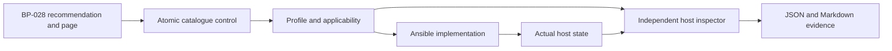

# ANSSI traceability

Every catalogue entry identifies the publication, recommendation and printed page
that motivated it. The implementation path is attached to each automated entry;
the verification definition identifies the exact runtime key, file or review
evidence. Reports retain the control ID and source reference alongside the observed
state and result.

The source edition, SHA-256 hashes, complete candidate analysis and level-marker
review are in [source-review.md](source-review.md). A reference to R9, for example,
means the named parameter is derived from R9; it does not mean every parameter in
that recommendation is implemented.

## Automated-control map

All controls in this table are **Intermediary**. `runtime.yml` means
`ansible/roles/kernel/tasks/runtime.yml`; `network/main.yml` means
`ansible/roles/network/tasks/main.yml`; and `permissions.yml` means
`ansible/roles/filesystem/tasks/permissions.yml`.

| Internal control ID | Source / printed page | Implementation | Independent observation |
| --- | --- | --- | --- |
| `bp028_r9_dmesg_restrict` | R9 / 19 | `runtime.yml` | `kernel.dmesg_restrict` |
| `bp028_r9_kptr_restrict` | R9 / 19 | `runtime.yml` | `kernel.kptr_restrict` |
| `bp028_r9_perf_event_paranoid` | R9 / 19 | `runtime.yml` | `kernel.perf_event_paranoid` |
| `bp028_r9_randomize_va_space` | R9 / 19 | `runtime.yml` | `kernel.randomize_va_space` |
| `bp028_r9_sysrq` | R9 / 19 | `runtime.yml` | `kernel.sysrq` |
| `bp028_r11_ptrace_scope` | R11 / 21 | `runtime.yml` | `kernel.yama.ptrace_scope` |
| `bp028_r12_all_accept_redirects` | R12 / 21 | `network/main.yml` | `net.ipv4.conf.all.accept_redirects` |
| `bp028_r12_default_accept_redirects` | R12 / 21 | `network/main.yml` | `net.ipv4.conf.default.accept_redirects` |
| `bp028_r12_all_accept_source_route` | R12 / 21 | `network/main.yml` | `net.ipv4.conf.all.accept_source_route` |
| `bp028_r12_default_accept_source_route` | R12 / 21 | `network/main.yml` | `net.ipv4.conf.default.accept_source_route` |
| `bp028_r12_all_send_redirects` | R12 / 22 | `network/main.yml` | `net.ipv4.conf.all.send_redirects` |
| `bp028_r12_default_send_redirects` | R12 / 22 | `network/main.yml` | `net.ipv4.conf.default.send_redirects` |
| `bp028_r14_suid_dumpable` | R14 / 23 | `runtime.yml` | `fs.suid_dumpable` |
| `bp028_r14_protected_fifos` | R14 / 23 | `runtime.yml` | `fs.protected_fifos` |
| `bp028_r14_protected_regular` | R14 / 23 | `runtime.yml` | `fs.protected_regular` |
| `bp028_r14_protected_symlinks` | R14 / 23 | `runtime.yml` | `fs.protected_symlinks` |
| `bp028_r14_protected_hardlinks` | R14 / 23 | `runtime.yml` | `fs.protected_hardlinks` |
| `bp028_r50_shadow` | R50 / 48 | `permissions.yml` | `/etc/shadow` metadata |
| `bp028_r50_gshadow` | R50 / 48 | `permissions.yml` | `/etc/gshadow` metadata |

`tools/inspect_host.py` reads live `/proc/sys` values and the HardenOps persistence
file for each sysctl. It checks sensitive-file metadata without reading password
hashes. `ansible/playbooks/verify.yml` runs a new observation independently of the
enforcement task's changed/unchanged result. `tests/integration/test_host.py`
contains opt-in Testinfra checks against an explicitly selected hardened VM.

The inspector unit tests in `tests/unit/test_inspect_host.py` exercise independent
observations, stronger-value preservation, missing features, unsafe files,
applicability and audit status handling. `tests/unit/test_catalog.py` protects
source levels and catalogue/profile structure. These tests check their stated
scope; a passing fixture test is not evidence that a target VM was hardened.

## Evidence and review controls

| Internal control ID | Level | Source / printed page | Treatment |
| --- | --- | --- | --- |
| `bp028_r30_unused_accounts` | Minimal | R30 / 34 | AUDIT_ONLY account inventory; an operator identifies unused accounts |
| `bp028_r53_unknown_owners` | Minimal | R53 / 50 | AUDIT_ONLY unresolved file/directory owners or groups |
| `bp028_r54_world_writable_dirs` | Minimal | R54 / 51 | AUDIT_ONLY sticky-bit and root-ownership review |
| `bp028_r56_setid_inventory` | Minimal | R56 / 52 | AUDIT_ONLY special-permission inventory and trust review |
| `bp028_r59_repository_review` | Minimal | R59 / 53 | MANUAL review of official or authorised internal repositories |
| `bp028_r61_update_procedure` | Minimal | R61 / 54 | MANUAL review of responsive security-maintenance procedure |
| `bp028_r68_password_storage` | Minimal | R68 / 61 | OUT_OF_SCOPE_REFERENCE_REQUIRED: missing publication [9], section 4.6 |
| `bp028_r13_disable_ipv6` | Intermediary | R13 / 22 | MANUAL boot/runtime lifecycle review when IPv6 is unnecessary; otherwise NOT_APPLICABLE |
| `bp028_r32_session_lock` | Intermediary | R32 / 35 | MANUAL inactivity-locking review of local TTY/graphical sessions |

For filesystem inventories, the report states the actual scan scope and any
truncation or failure. An empty bounded inventory is not proof that an entire
host satisfies the recommendation. A result requiring review is not converted to
PASS because no automated check failed.

PA-085 contributes architectural guidance about reference configurations, least
privilege, accountability and maintenance. Its recommendation numbers are kept
separate from BP-028 and are discussed in [source-review.md](source-review.md).
HardenOps does not certify ANSSI conformance, regulatory compliance or homologation.
