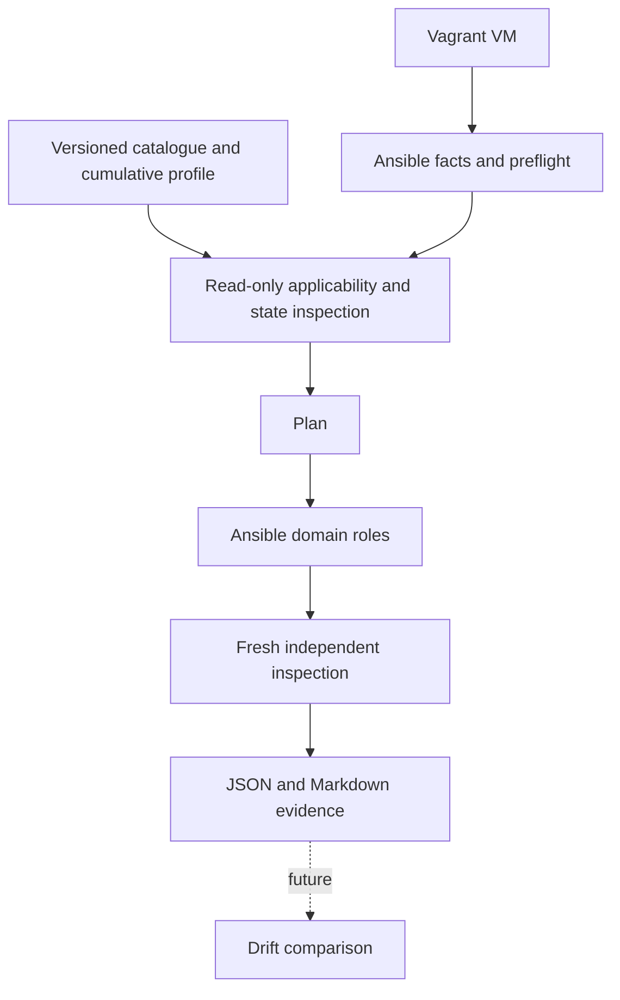

# Architecture

HardenOps keeps the policy in a small YAML catalogue and uses Ansible to change
the host. A standalone, standard-library Python inspector reads actual state.
The inspector does not call the enforcement tasks or accept their success flags.

`baseline.yml` validates prerequisites; it installs nothing. The selected boxes
already provide Python, SSH and sudo. `plan.yml` collects facts and inspects the
target without changing its configuration. Normal SSH authentication logs and
Ansible transport activity still occur. `harden.yml` repeats inspection immediately
before enforcement and imports `verify.yml` afterwards. Running `verify.yml`
alone produces the same independent evidence.

The kernel and network roles share the same sysctl task. The filesystem role
reuses it for filesystem sysctls and separately restricts shadow-file metadata.
There are no duplicated distribution roles. Accounts and package policy remain
audits or manual reviews, so they do not have empty enforcement roles.

The inspector receives the catalogue as JSON on stdin and reads `/proc/sys`,
owned sysctl files and file metadata. Targets need Python 3.9 or later, without
PyYAML or a testing framework. JSON contains expected and observed values,
source recommendation, applicability reason, transition metadata and context.
The controller renders Markdown. Reports deliberately contain no password hashes.

PA-085 supplies complementary operational guidance: a reviewed reference
configuration becomes version-controlled desired state; Ansible enforces selected
parts; verification records deviations. Comparing those records over time is
future drift detection. This implements a limited mechanism supporting that
operational model, not the whole PA-085 guide. See [source review](source-review.md)
for exact references. PA-085 levels are never used to classify BP-028 controls.

No automatic reboot is required by the automated subset. IPv6 boot changes and
local session locking remain manual. Reboot testing is needed before relying on
persistence across a real boot; v0.1 checks runtime and owned configuration, not
every possible boot-time override.
